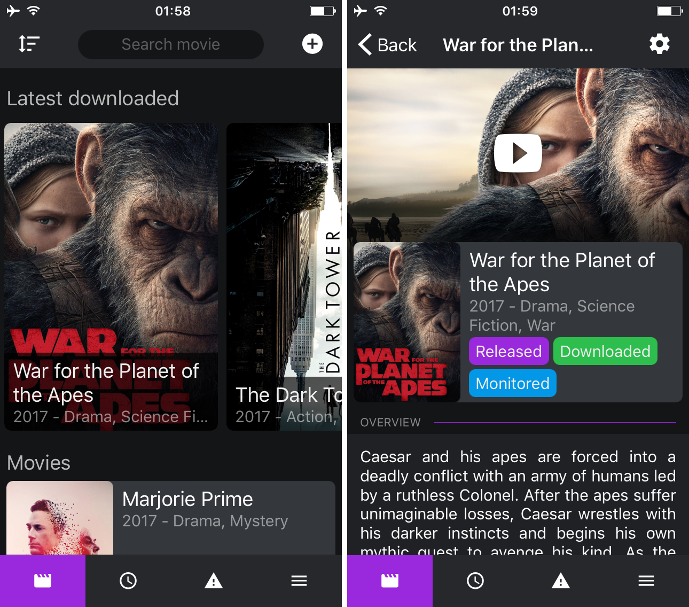

# Unofficial offline-first Radarr iOS/Android Client

## About
An offline-first app for [Radarr](https://github.com/Radarr/Radarr)

After you input the Radarr API details it will download *all* info from **Radarr** and keep in storage for **offline** use.

## Usage
Open the [Expo app](https://expo.io) and scan the [QR Code](https://expo.io/@diogoabu/radarr):

## Issues
- **Images are not shown after download** ([react-native/issues/13316](https://github.com/facebook/react-native/issues/13316)).
  - Tap the last Icon on the Tab Bar and tap the Server widget to go back to the Server List and re-enter the Server.
  - On Android just tap the Back Button and re-enter the Server.

## More
- [Developer's Guide](DEVELOP.md)
- [Todos](TODO.md)
